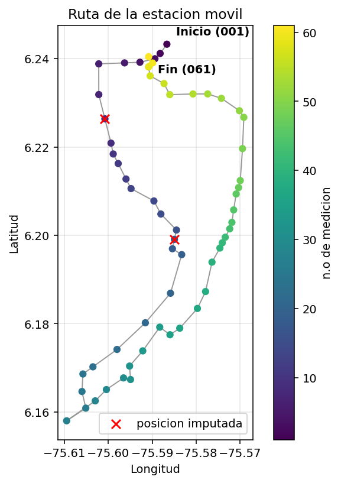
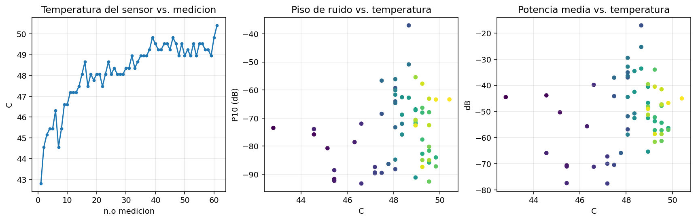
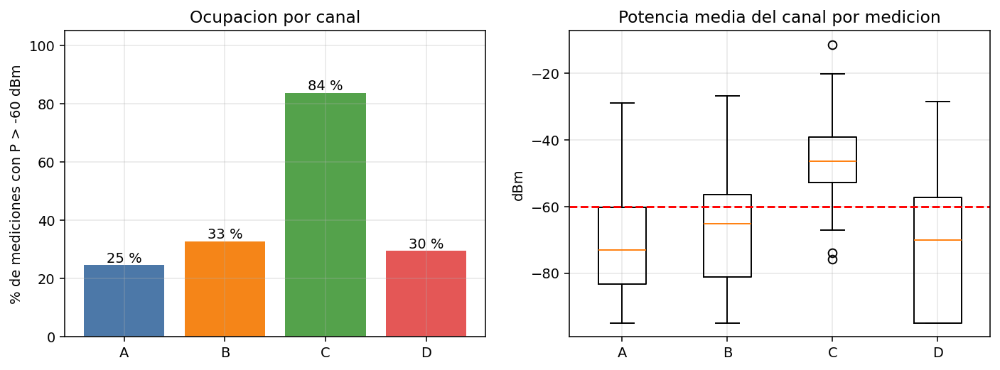
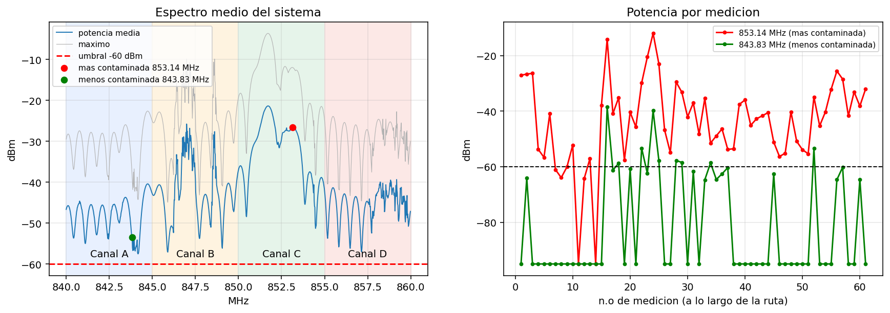
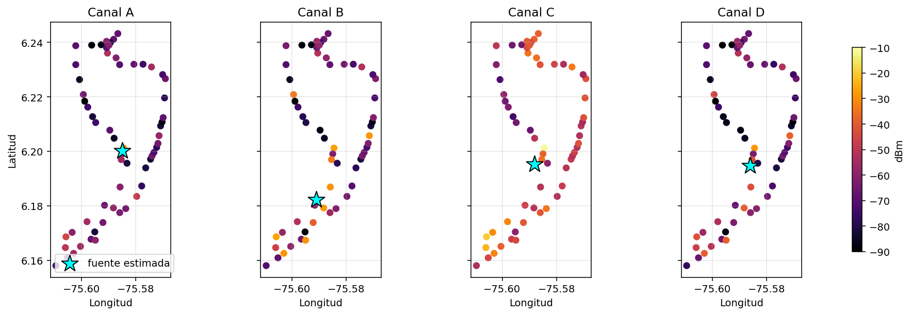

# Informe tecnico - Ocupacion del espectro 840-860 MHz, occidente de Medellin
*Examen 3, Internet de las Cosas - Analisis para la Agencia Nacional del Espectro (ANE)*
**Analista:** Stefany Morelos

## Resumen ejecutivo
Trabaje con **61 mediciones** tomadas por una estacion movil (banda 840-860 MHz, 1024 bins, resolucion de aprox. 19.5 kHz por bin) a lo largo de una ruta de 26.2 km en el occidente de Medellin.
Con esos datos, el canal **mas contaminado resulto ser el C** (850-855 MHz, ocupado en el 84 % de las mediciones) y el **menos contaminado el A**
(25 %). Viendo frecuencia por frecuencia, la mas contaminada de todo el sistema es 853.14 MHz y la menos contaminada 843.83 MHz.

## 1. Datos de los sensores
### 1.1 Calidad de los datos
Antes de calcular cualquier indicador revise que tan confiables eran los datos crudos. La completitud de los espectros quedo en 100.0 % y las posiciones GPS validas en 96.7 % (es decir, casi todo estaba en buen estado, pero no todo).

| Verificacion | Casos | Detalle |
|---|---|---|
| Archivos con estructura valida (1024 + 5 columnas) | 63 | 0 rechazados |
| Valores NaN / infinitos en espectros | 0 |  |
| Espectros fuera de rango fisico (>0 dB o <-120 dB) | 0 |  |
| GPS sin fijar (lat=lon=0, alt=0) | 1 | 008.txt |
| GPS con HDOP > 5.0 | 1 | 017.txt (HDOP 17.3) |
| Temperatura fuera de rango operativo | 0 |  |
| Espectros con posible saturacion (pico > -5 dB) | 1 | 016.txt |
| Archivos de prueba descartados | 2 | medidaprueba.txt, medidapureba2.txt |

### 1.2 Imputaciones y correcciones
Sin contar la regla de piso que pide el enunciado, modifique **136** valores; contando esa regla, el total sube a **33895** (de 62464 valores de espectro en total). Se aplico la regla de normalizacion del enunciado (valores < -65 dB -> -95 dB).

| Problema | Tecnica | Valores modificados | Motivo | % del total |
|---|---|---|---|---|
| GPS sin fijar (lat, lon, alt) | Interpolacion lineal entre vecinos | 3 | Sin fix: coordenadas = 0 | 0.005 |
| GPS con HDOP > 5.0 (lat, lon, alt) | Interpolacion lineal entre vecinos | 3 | Precision horizontal no confiable | 0.005 |
| Espiga DC (bin 850.000 MHz) | Promedio de bins vecinos | 61 | Artefacto de conversion directa | 0.097 |
| Espigas aisladas <=2 bins | Mediana local (11 bins) | 69 | Ruido/interferencia espuria | 0.110 |
| Piso de ruido (<-65.0 -> -95.0 dB) | Sustitucion (regla del enunciado) | 33759 | Normaliza el piso de ruido | 53.888 |

Por que hice cada correccion: cuando el GPS no tiene fix (lat = lon = 0) o el HDOP es mayor a 5, la posicion no es confiable, asi que la reconstruyo interpolando entre las mediciones vecinas en el tiempo. La espiga que aparece siempre en 850.000 MHz no es una senal real, es un artefacto conocido de los receptores de conversion directa (fuga del oscilador local), por eso la reemplazo con el promedio de sus vecinos. Las espigas angostas (1-2 bins) tampoco pueden ser senales celulares reales -esas ocupan decenas de bins-, asi que las trato como ruido puntual y las corrijo con la mediana local. Las mediciones con posible saturacion (016.txt) las dejo en el dataset pero marcadas, para no perder informacion.

### 1.3 Ruta de la estacion movil
La ruta arranca en (6.24326, -75.58667) y termina en (6.24042, -75.59083): 26.2 km recorridos en 104 min
(unos 15 km/h en promedio), con altitud entre 1499 y 1590 m. El punto de inicio y el de fin quedan a solo 557 m de distancia, o sea que el circuito casi se cierra.

### 1.4 Incidencia de la temperatura del sensor
La temperatura del sensor se movio entre 42.8 y 50.4 C durante la campana.

| indicador | Pearson r | p | r parcial (ctrl. tiempo) | p (parcial) |
|---|---|---|---|---|
| piso_ruido_dB | 0.211 | 0.103 | 0.096 | 0.460 |
| potencia_media_dB | 0.249 | 0.053 | 0.151 | 0.244 |
| desv_espectro_dB | 0.283 | 0.027 | 0.153 | 0.238 |

**No se encuentra una incidencia significativa** de la temperatura sobre la calidad de las medidas: las correlaciones brutas son debiles y la variable esta fuertemente confundida con el tiempo (r = 0.86; el sensor se calienta a lo largo del recorrido); al controlar el tiempo desaparecen.

## 2. Indicadores por canal
Para cada canal de 5 MHz calculo la potencia media con la identidad de Parseval discreta: P = (1/N) * Sum |X_k|^2 sobre los N = 256 bins que le corresponden (modo `media`). Considero un canal ocupado/contaminado en una medicion si esa potencia supera -60 dBm, tal como lo pide el enunciado.

| Canal | Banda (MHz) | Ocupacion (% de mediciones > umbral) | IC95 ocupacion (%) | Potencia media (dBm) | Mediana (dBm) | P90 (dBm) | Dictamen |
|---|---|---|---|---|---|---|---|
| A | 840-845 | 24.6 | 16-37 | -46.4 | -73.0 | -54.6 | Recomendado |
| B | 845-850 | 32.8 | 22-45 | -37.0 | -65.1 | -29.2 | Condicionado |
| C | 850-855 | 83.6 | 72-91 | -28.2 | -46.3 | -33.7 | No recomendado |
| D | 855-860 | 29.5 | 20-42 | -44.5 | -70.1 | -42.6 | Condicionado |

El intervalo de confianza del canal A se traslapa con el de B, D: con 61 mediciones esos canales no son estadisticamente distinguibles entre si; la diferencia significativa es la del canal C.

Tambien revise que tan sensible es este ranking a las decisiones que tome en la limpieza (por ejemplo, que pasa si no aplico la regla del piso, o si en vez de potencia promedio uso potencia total):

| Canal | Ocup. % (indicadores) | Ocup. % sin piso | Ocup. % potencia suma |
|---|---|---|---|
| A | 24.6 | 24.6 | 80.3 |
| B | 32.8 | 32.8 | 75.4 |
| C | 83.6 | 85.2 | 100.0 |
| D | 29.5 | 29.5 | 70.5 |

### 2.1 Banda mas y menos contaminada
El **Canal C** queda como el mas contaminado, con -28.2 dBm de potencia media, y el **Canal A** como el menos contaminado, con -46.4 dBm.
Si miro frecuencia por frecuencia (no por canal completo), la mas contaminada es **853.145 MHz** (ocupada en el 90 % de las mediciones, -26.6 dBm en promedio) y la menos contaminada **843.828 MHz** (15 %, -53.5 dBm).

### 2.2 Recomendacion tecnica para la Agencia
Use el siguiente criterio: ocupacion menor a 25 % -> *recomendado*; entre 25 % y 50 % -> *condicionado*; 50 % o mas -> *no recomendado*. Con base en eso, mi recomendacion para la ANE es:
- **Recomendados:** Canal A (840-845 MHz).
- **Condicionados (necesitan coordinacion o alguna medida de mitigacion antes de asignarse):** Canal B (845-850 MHz), Canal D (855-860 MHz).
- **No recomendados:** Canal C (850-855 MHz).

## 3. Bonificacion - ubicacion estimada de las fuentes
Para estimar de donde viene la contaminacion de cada canal, probe dos metodos: un modelo de propagacion log-distancia (que extrapola hacia atras de donde tuvo que salir la senal) y, como respaldo, el centroide ponderado del 10 % de los puntos con mas potencia. Solo me quedo con el modelo si de verdad explica los datos (R^2 >= 0.5); si no, uso el centroide y lo dejo claro en la tabla para no inflar la confianza del resultado. La incertidumbre la calculo con bootstrap (radio del 95 %).

| canal | lat | lon | metodo | radio95_m | R2_modelo | n_perdidas |
|---|---|---|---|---|---|---|
| A | 6.20016 | -75.58509 | centroide ponderado | 3325 | 0.12 | 2.0 |
| B | 6.18217 | -75.59103 | centroide ponderado | 1662 | 0.15 | 2.0 |
| C | 6.19529 | -75.58818 | centroide ponderado | 3433 | 0.10 | 2.0 |
| D | 6.19477 | -75.58619 | centroide ponderado | 2573 | 0.14 | 2.0 |

## 4. Limitaciones
Para ser honesta con lo que si puedo afirmar y lo que no:
- Los niveles vienen de una captura *max-hold* de 100 espectros, sin una calibracion absoluta documentada del receptor (dBFS); por eso mis conclusiones son comparativas entre canales, no valores absolutos certificados.
- Fue una sola campana de ~104 minutos, asi que no alcanza a capturar como varia la ocupacion en otras horas del dia.
- Las potencias de los canales A, B y D estan bastante correlacionadas entre si (r entre 0.64 y 0.96) y sus picos coinciden con los del canal C. Esto me hace sospechar que parte de la "contaminacion" que veo puede deberse a que el receptor se satura o intermodula cuando llega una senal fuerte (la medicion 016.txt quedó marcada por eso). Si se repite la campana, recomendaria usar un atenuador o un filtro pasabanda.
- La estimacion de fuentes es la parte menos solida del analisis: el modelo log-distancia explica poca varianza (R^2 maximo de 0.15) porque hay multitrayecto, probablemente varias fuentes simultaneas y la captura es max-hold; tomo las coordenadas resultantes como una localizacion aproximada, no como una direccion exacta.

---
*Para cerrar:* Por que el gato no confia en el WiFi de la casa? Porque cada vez que salta a la mesa, la senal se cae.
